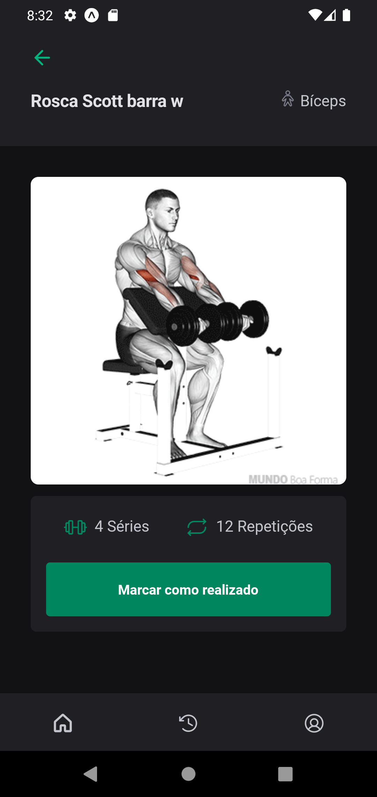
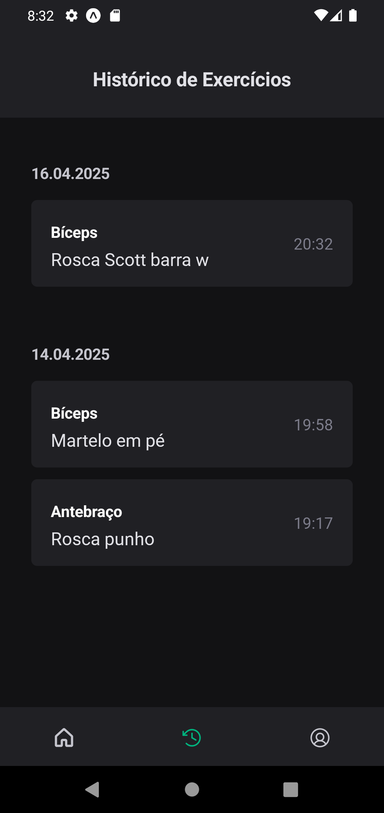

# 🚀 Ignite Gym - React Native (Rocketseat)

Projeto desenvolvido como parte do **Projeto 3**  da trilha de **React Native** na plataforma [Rocketseat](https://www.rocketseat.com.br/).  
O objetivo é criar uma aplicação mobile para **gerenciamento de treinos em academias**, permitindo ao usuário registrar seus exercícios e acompanhar o histórico de atividades físicas. Durante o desenvolvimento, são aplicados conceitos essenciais do **React Native** com **Expo**, navegação entre telas, gerenciamento de estado, comunicação com API e estilização com componentes reutilizáveis.

---

## 📁 **Criando o Projeto**
Para criar este projeto, foi utilizado o comando:
```bash
npx create-expo-app ignitegym --template
```

## 📦 **Instalação**
Antes de executar o projeto, instale as dependências com:
```bash
npm install
```


## ▶️ **Execução**
Para iniciar a aplicação, utilize:
```bash
npx expo start
```

O comando abrirá o **Expo DevTools** no navegador.  
Você pode rodar o app em um emulador ou escanear o QR code com o app **Expo Go** no celular.


## 🔗 **Backend**
Para conectar com o backend, utilize o repositório oficial da API:  
👉 [ignitegym-api](https://github.com/orodrigogo/ignitegym-api)
(Não se esqueça de indicar o IP local do servidor backend no arquivo [api.ts](./src/services/api.ts))


## 📸 **Pré-visualização do App**

<p align="center">
  
  
</p>
<p align="center">
  
  
</p>
<p align="center">
  
  
</p>

## 🛠️ **Tecnologias & Conceitos Aplicados**
- **Componentes Básicos**: View, Text, Image, TouchableOpacity, ScrollView
- **Estilização**: com **Gluestack UI** e **expo-google-fonts**
- **Navegação**: **React Navigation** com Stack e Bottom Tabs
- **Validação de Formulários**: **React Hook Form + Yup**
- **Armazenamento Local**: **Async Storage**
- **Consumo de API**: **Axios**
- **Manipulação de Imagens**: com **expo-image-picker** e **expo-file-system**
- **SVG como Componentes**: com **react-native-svg-transformer**


## 📦 **Recursos e Bibliotecas Utilizadas**

### [expo-google-fonts](https://docs.expo.dev/develop/user-interface/fonts/)
- Utilização de fontes personalizadas do Google (Roboto).
- Instalação:
  ```
  npx expo install expo-font @expo-google-fonts/roboto
  ```
- 🗓️ **Adicionado em:** 13/03/2025

### [gluestack](https://gluestack.io)
- Component Library para otimização e reutilização de código.
- Instalação:
  ```
  npm install @gluestack-ui/themed@1.1.34 @gluestack-style/react@1.0.57 @gluestack-ui/config@1.1.19 --legacy-peer-deps
  ```
- Correção de bugs:
  ```
  npm uninstall react-dom
  ```
- Dependências:
  ```
  npx expo install react-native-svg
  ```
- Observações: ejetar tema com `npx gluestack-ui-scripts eject-theme`  
- 🗓️ **Adicionado em:** 13/03/2025

### [react-native-svg-transformer](https://github.com/kristerkari/react-native-svg-transformer)
- Permite utilizar arquivos SVG como componentes.
- Instalação:
  ```
  npm install --save-dev react-native-svg-transformer --legacy-peer-deps
  ```
- Configurado em: [`metro.config.js`](./metro.config.js)  
- 🗓️ **Adicionado em:** 14/03/2025

### [react-navigation](https://reactnavigation.org/docs/getting-started)
- Gerenciamento de navegação.
- Instalação:
  ```
  npm install @react-navigation/native
  ```
- Dependências:
  ```
  npx expo install react-native-screens react-native-safe-area-context
  ```
- Estratégias:
  ```
  npm install @react-navigation/native-stack
  npm install @react-navigation/bottom-tabs
  ```
- 🗓️ **Adicionado em:** 14/03/2025

### [lucide-react-native](https://lucide.dev/guide/packages/lucide-react-native)
- Biblioteca moderna de ícones.
- Instalação:
  ```
  npm install lucide-react-native
  ```
- 🗓️ **Adicionado em:** 14/03/2025

### [expo-image-picker](https://docs.expo.dev/versions/latest/sdk/imagepicker/)
- Seleção de imagens do dispositivo.
- Instalação:
  ```
  npx expo install expo-image-picker
  ```
- 🗓️ **Adicionado em:** 09/04/2025

### [expo-file-system](https://docs.expo.dev/versions/latest/sdk/filesystem/)
- Manipulação de arquivos no dispositivo.
- Instalação:
  ```
  npx expo install expo-file-system
  ```
- 🗓️ **Adicionado em:** 09/04/2025

### [react-hook-form](https://react-hook-form.com)
- Manipulação de formulários com menos código e alta performance.
- Instalação:
  ```
  npm install react-hook-form
  ```
- 🗓️ **Adicionado em:** 09/04/2025

### [@hookform/resolvers + yup](https://react-hook-form.com/get-started#SchemaValidation)
- Integração com bibliotecas de validação.
- Instalação:
  ```
  npm install @hookform/resolvers yup
  ```
- 🗓️ **Adicionado em:** 09/04/2025

### [axios](https://axios-http.com/ptbr/docs/intro)
- Facilita requisições HTTP.
- Instalação:
  ```
  npm install axios
  ```
- 🗓️ **Adicionado em:** 11/04/2025

### [async-storage](https://docs.expo.dev/versions/latest/sdk/async-storage/)
- Armazenamento de dados localmente.
- Instalação:
  ```
  npx expo install @react-native-async-storage/async-storage
  ```
- 🗓️ **Adicionado em:** 11/04/2025


## 📌 Observações
- Em caso de erros na instalação, tente limpar os pacotes e reinstalar:
  ```
  rm -rf node_modules package-lock.json
  npm install
  ```


## 💡 **Sobre o Curso**
Projeto desenvolvido durante o curso de **React Native** na Rocketseat, com foco em práticas modernas de desenvolvimento mobile, organização de código e integração com API externa.


Feito com ❤️ por **Cesar August**